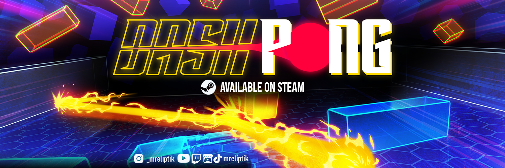

<!-- 
 
  

 -->

## Hey there, I'm Victor 

My name is Victor Meunier (MrEliptik) and I'm a French full time indie gamedev living near the moutains ⛰️. I make games with Godot, and create videos on YouTube. 
If you want to work with me, contact me at [victormeunier.dev@gmail.com](mailto:victormeunier.dev@gmail.com) 📧

### &#x270d; Blog

Apart from coding and YouTube, I also maintain a blog - you can find my articles on my website at [https://mreliptik.dev/](https://mreliptik.dev/).

### 🧪 Experiments with Godot

 
 

### 🧰 Tools & addons

 

 

### 🎮 Twitch overlays and games made with Godot

### 📱 Android apps

  

 

